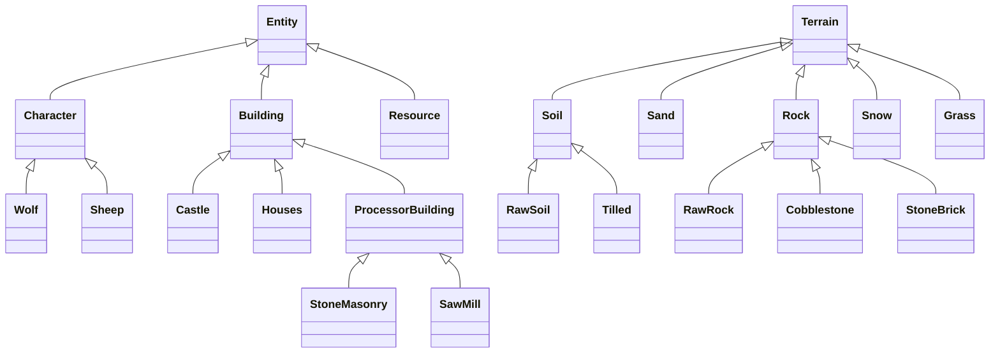
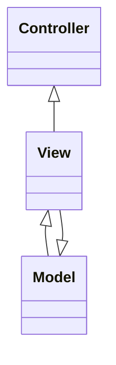
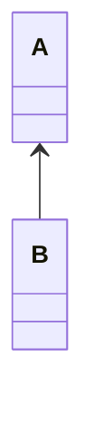

# Classes

## Class Diagram

## Terrain
Soil, Sand, and Rock make up the base ground elements.

Grass and Snow solely exist on top of another base terrain. This property can be extrapolated to all of the terrains, where stone must be the base element that others are built on.

---

## Architecture Diagram

